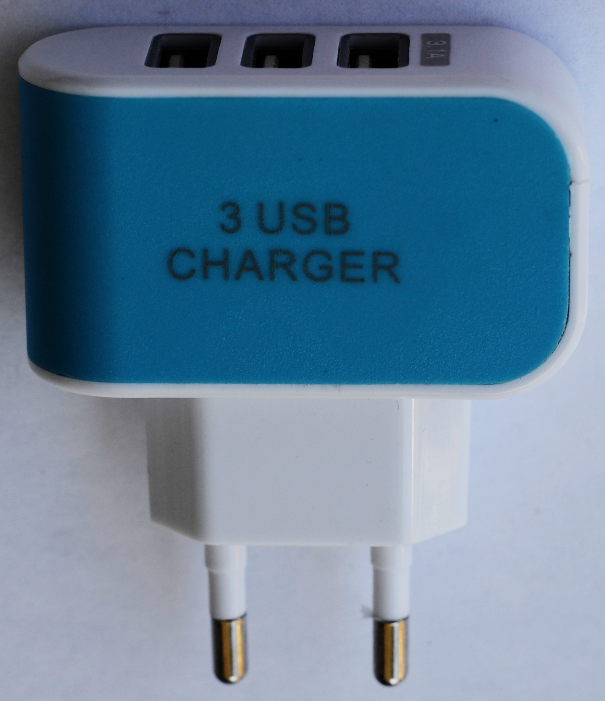
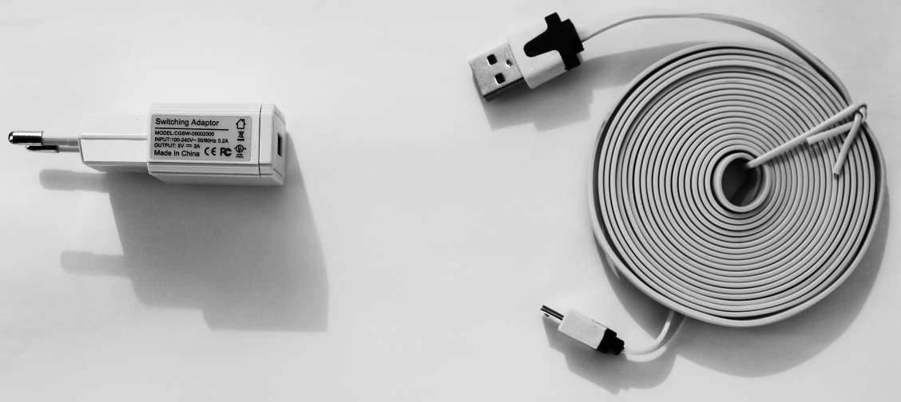
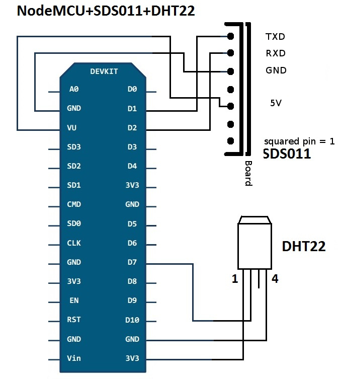
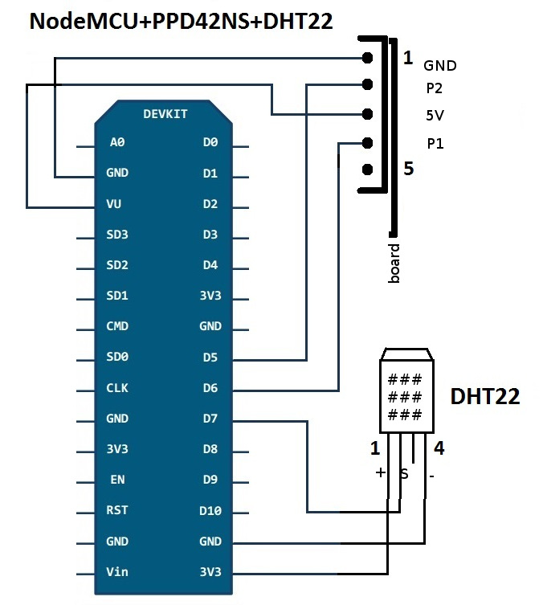

# Station bauen

Diese Anleitung erläutert den Zusammenbau einer Feinstaubmesstation, wie sie im OK-Lab Stuttgart entwickelt wurde.

## Einzelteile, die benötigt werden:

|Bauteil|Abbildung|
|:-----------------------------------------|-----------------------------------------------:|
|ESP8266 (WLAN, Prozessor)|{width=13%} <!--  * PPD42NS (Feinstaub messen)   -->|
|SDS011 (Feinstaub messen), ersetzt PPD42NS|{width=25%}|
|DHT22 (Temperatur & Luftfeuchtigkeit)|<!-- {width=19%} -->{width=9%}|
|Abflussröhren zur Außenmontage|<!-- {width=49%} -->{width=29%}|
|Stromversorgung (MicroUSB-Kabel + Netzteil)|<!-- {width=49%} -->{width=9%}|
|Kleinkram (Kabel, LED, ...)|{width=29%}|

* Zugang zu Wifi-Netzwerk (ESSID + Passphrase), optional ein Freifunk-Router

![Alle elektronischen Teile]8images/sensor/all_electronic_parts.jpg)

## Zusammenbau

Siehe Wiki unter \href{https://github.com/opendata-stuttgart/meta/wiki/Zusammenbau-der-Komponenten}{github.com/opendata-stuttgart/meta/wiki/Zusammenbau-der-Komponenten}

{width=49%}

Für die Montage der einzelnen Komponenten empfehlen sich Dupont-Kabel mit ca. 20 cm Länge (siehe Bestellliste).

WICHTIG !! Bei Verwendung des SDS011 unbedingt vor dem Zusammenbau die Firmware aufspielen !!

Es scheint so, als ob die "Original-Firmware" nach Auslieferung auf einen der Pins D1 oder D2 5V schaltet, die zur Beschädigung des SDS011 führen können.

Optional, aber besser: DHT22 +(PIN1) auch an 5V(VU), z.B. mit doppelt männlichem Dupont-Kabel auf VU Dupontbuckse aufstecken.

### Anschluß SDS011

Pins sind von RECHTS nach LINKS nummeriert, beim Verbinden darauf achten, das die Kabel wirklich auf den Pins stecken, da die meisten Dupont-Kabel auch "neben" die Pins passen

    SDS011 Pin 1 -> Pin D1 / GPIO5
    SDS011 Pin 2 -> Pin D2 / GPIO4
    SDS011 Pin 3 -> GND
    SDS011 Pin 4 -> unused
    SDS011 Pin 5 -> VU (NodeMCU v3) / VIN (NodeMCU v2)
    SDS011 Pin 6 -> unused
    SDS011 Pin 7 -> unused

### Anschluß des DHT22

Pins sind von LINKS nach RECHTS nummeriert, Vorderseite ist das "Gitter"

    DHT22 Pin 1 -> Pin 3V3 (3.3V)
    DHT22 Pin 2 -> Pin D7 (GPIO13)
    DHT22 Pin 3 -> unused
    DHT22 Pin 4 -> Pin GND

<!-- \clearpage -->

### Einbau in Röhren

{width=49%}
{width=49%}

* Mit zwei Kabelbindern können die Teile leicht zusammengebaut werden und passen dann genau in die Röhren 
* Einbau so, dass der Lüfter des SDS unten ist und auf der Seite der Röhre, die keine Gummidichtung hat
* zweites Teil aufstecken, dabei USB-Kabel herausführen

## Konfiguration der Station

* Station einschalten (Stromkabel verbinden)
* die Station versucht, sich auf den konfigurierten WLAN-Accesspoint zu verbinden
* wenn das nicht klappt, öffnet der Sensor einen Accesspoint mit dem Namen *Feinstaubsensor-<ID>*, wobei <ID> die ChipID ist.
* Man verbinde sich mit diesem Wireless-Netzwerk
* und rufe dann die Seite \href{http://192.168.4.1/}{http://192.168.4.1/} auf, dort kann der Sensor konfiguriert werden
* unter *Configure Wifi* SSID und password des eigenen Netzes eintragen
    * *(0/1)?* bedeutet, dass 1 (=ja) oder 0 (=nein) eingetragen wird (1 für ja/vorhanden, 0 für nein/nicht_da)
    * sinnvolle Voreinstellungen sind (mit SDS011 und DHT Sensoren):

            1 "Senden an luftdaten.info (0/1) ?"
            1 "Senden an madavi.de (0/1) ?"
            0 "Seriell als CSV (0/1) ?"
            1 "DHT Sensor (0/1) ?"
            0 "PPD42NS Sensor (0/1) ?"
            1 "SDS Sensor (0/1) ?"
            0 "BMP Sensor (0/1) ?"
            1 "Auto-Update (0/1) ?"
            0 "Display (0/1) ?"
            3 "Debug output (0-5) ?"
            0 "Senden an eigene API (0/1)?"

<!-- {width=49%} -->

{width=49%}

<!-- {width=49%} -->

<!--  -->
<!-- output on serial
mounting FS...
mounted file system...
config file not found ...
6
Connecting to FREIFUNK
....................
---- Result from Webconfig ----
WLANSSID: Freifunk
DHT_read:  - 1
PPD_read:  - 0
SDS_read:  - 1
BMP_read:  - 0
Dusti:  - 1
Madavi:  - 1
CSV:  - 0
Display:  - 0
Custom API:  - 0
------
WiFi connected
              IP address: 192.168.44.131
saving config...
{"SOFTWARE_VERSION":"NRZ-2016-020","wlanssid":"Freifunk","wlanpwd":"","dht_read":true,"ppd_read":false,"sds_read":true,"bmp_read":false,"send2dusti":true,"send2madavi":true,"send2mqtt":false,"send2csv":false,"auto_update":true,"has_display":false,"debug":3,"send2custom":false,"host_custom":"192.168.234.1","url_custom":"/data.php","httpPort_custom":80}
Starting OTA update ...

mounting FS...
mounted file system...
reading config file...
opened config file...
parsed json...
6
Connecting to Freifunk
.........
WiFi connected
              IP address: 192.168.44.131
saving config...
{"SOFTWARE_VERSION":"NRZ-2016-028","wlanssid":"Freifunk","wlanpwd":"","dht_read":true,"ppd_read":false,"sds_read":true,"bmp_read":false,"gps_read":false,"send2dusti":true,"send2madavi":true,"send2mqtt":false,"send2lora":false,"send2csv":false,"auto_update":true,"has_display":false,"debug":3,"send2custom":false,"host_custom":"192.168.234.1","url_custom":"/data.php","httpPort_custom":80}
Starting OTA update ...
[update] No Update.

ChipId: 
418466
Lese SDS...
Lese DHT...
Sende an luftdaten.info...
Sende an madavi.de...
Auto-Update wird ausgeführt...
PM10:  11.43
PM2.5: 6.25
------
Humidity    : 52.90%
Temperature : 26.50 C
------
Creating data string:
## Sending to luftdaten.info (SDS):
Start connecting to api.luftdaten.info
Requesting URL: /v1/push-sensor-data/
418466
{"software_version": "NRZ-2016-028", "sensordatavalues":[{"value_type":"P1","value":"11.43"},{"value_type":"P2","value":"6.25"},{"value_type":"samples","value":"535701"},{"value_type":"min_micro","value":"101"},{"value_type":"max_micro","value":"32678"}]}

closing connection
                  ------

End connecting to api.luftdaten.info
## Sending to luftdaten.info (DHT):
Start connecting to api.luftdaten.info
Requesting URL: /v1/push-sensor-data/
418466
{"software_version": "NRZ-2016-028", "sensordatavalues":[{"value_type":"temperature","value":"26.50"},{"value_type":"humidity","value":"52.90"},{"value_type":"samples","value":"535701"},{"value_type":"min_micro","value":"101"},{"value_type":"max_micro","value":"32678"}]}

closing connection
                  ------

End connecting to api.luftdaten.info
## Sending to madavi.de:
Start connecting to www.madavi.de
Requesting URL: /sensor/data.php
418466
{"software_version": "NRZ-2016-028", "sensordatavalues":[{"value_type":"SDS_P1","value":"11.43"},{"value_type":"SDS_P2","value":"6.25"},{"value_type":"temperature","value":"26.50"},{"value_type":"humidity","value":"52.90"},{"value_type":"samples","value":"535701"},{"value_type":"min_micro","value":"101"},{"value_type":"max_micro","value":"32678"}]}

closing connection
                  ------

End connecting to www.madavi.de

-->

